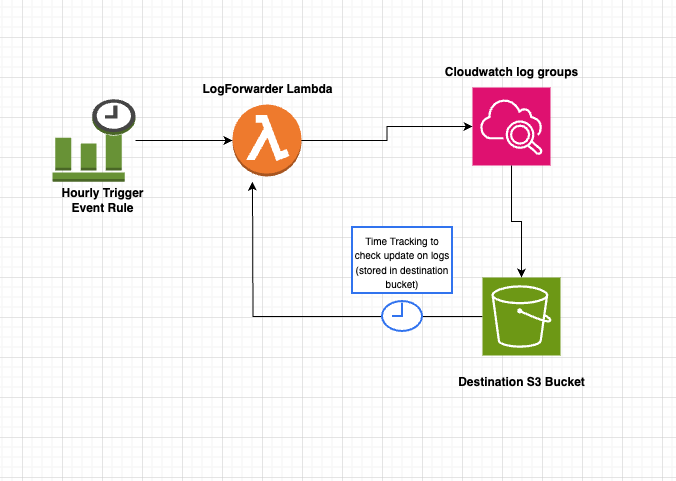

# CloudWatch Logs to Cross Account S3 Export Solution

## Solution Overview
This solution provides an automated way to export AWS CloudWatch Logs to an S3 bucket on a scheduled basis. It uses AWS Lambda and CloudWatch Events to regularly export logs without manual intervention, making it ideal for data retention, compliance, and analysis purposes.

## Prerequisites
Before deploying this solution, ensure you have:

- An AWS account with permissions to create the following resources:
  - IAM Roles and Policies
  - Lambda Functions
  - CloudWatch Event Rules
  - S3 Bucket (or permissions to access existing bucket)
  - Access to AWS Management Console
- An S3 bucket to store the exported logs (can be created before or after deployment)
- List of CloudWatch Log Groups you want to export

## Architecture Diagram


  

## Deployment Steps

### Step 1: Deploy the CloudFormation Template

1. Navigate to the CloudFormation console: [AWS CloudFormation](https://console.aws.amazon.com/cloudformation/)
2. Create a new stack:
   - Download the file: `CFN-logforwarder.yaml`
   - Click **Create stack** > **With new resources**
   - Select **Upload a template file**
   - Provide the downloaded file: `CFN-logforwarder.yaml`
   - Click **Next**
3. Configure stack parameters:
   - **Stack name**: Enter a name for your stack
   - **ResourceNamePrefix**: Enter a prefix applied to all created resources (per organization naming conventions)
   - **DestinationBucket**: Enter the name of your S3 bucket
   - **Region**: Enter the AWS region where your resources are located
   - **LogGroupsList**: Enter a comma-separated list of CloudWatch Log Group names to export
   - Click **Next**
4. Configure stack options:
   - Add tags if needed
   - Configure any advanced options if required
   - Click **Next**
5. Review and create:
   - Review all settings
   - Check the acknowledgment box (if prompted about IAM resources)
   - Click **Create stack**
6. Wait for deployment (typically takes 2-5 minutes)

### Step 2: Verify Deployment

#### Check Stack Outputs:
- In the CloudFormation console, go to the **Outputs** tab of your stack
- Note the Lambda function role ARN for reference

#### Verify Lambda Function:
- Navigate to the **Lambda console**
- Confirm that a function named `[ResourceNamePrefix]-LogForwarder` exists

#### Verify CloudWatch Event Rules:
- Navigate to the **CloudWatch console**
- Go to **Events** > **Rules**
- Confirm that rules like `[ResourceNamePrefix]-LogExport-1` exist (each rule should target the Lambda function)

### Step 3: Update Bucket Policy

1. Navigate to the **S3 console** > **Destination Bucket**
2. Go to the **Permissions** tab
3. Click **Bucket Policy**
   **CAUTION:** Make sure that there are no conflicting Deny Statements in bucket policy /SCP for organization
5. Replace placeholders in the following bucket policy, or add these statements to an existing policy:

<YOUR_BUCKET_NAME>: Your destination S3 bucket name.
<YOUR_REGION>: Your AWS region (e.g., ap-southeast-1).
<SOURCE_ACCOUNT_ID>: Your AWS account ID.
<LAMBDA_EXECUTION_ROLE_ARN>: The Lambda execution role ARN from your CloudFormation stack outputs.


```json

{
  "Version": "2012-10-17",
  "Statement": [
    {
      "Effect": "Allow",
      "Principal": {
        "Service": "logs.<YOUR_REGION>.amazonaws.com"
      },
      "Action": "s3:GetBucketAcl",
      "Resource": "arn:aws:s3:::<YOUR_BUCKET_NAME>",
      "Condition": {
        "StringEquals": {
          "aws:SourceAccount": "SOURCE_ACCOUNT_ID"
        },
        "ArnLike": {
          "aws:SourceArn": "arn:aws:logs:<YOUR_REGION>:SOURCE_ACCOUNT_ID:log-group:*"
        }
      }
    },
    {
      "Effect": "Allow",
      "Principal": {
        "Service": "logs.<YOUR_REGION>.amazonaws.com"
      },
      "Action": "s3:PutObject",
      "Resource": "arn:aws:s3:::<YOUR_BUCKET_NAME>/*",
      "Condition": {
        "StringEquals": {
          "s3:x-amz-acl": "bucket-owner-full-control",
          "aws:SourceAccount": "SOURCE_ACCOUNT_ID"
        },
        "ArnLike": {
          "aws:SourceArn": "arn:aws:logs:<YOUR_REGION>:SOURCE_ACCOUNT_ID:log-group:*"
        }
      }
    },
    {
      "Effect": "Allow",
      "Principal": {
        "AWS": "<LAMBDA_EXECUTION_ROLE_ARN>"
      },
      "Action": "s3:PutObject",
      "Resource": "arn:aws:s3:::<YOUR_BUCKET_NAME>/*",
      "Condition": {
        "StringEquals": {
          "s3:x-amz-acl": "bucket-owner-full-control"
        }
      }
    },
    {
      "Effect": "Allow",
      "Principal": {
        "AWS": "<LAMBDA_EXECUTION_ROLE_ARN>"
      },
      "Action": [
        "s3:GetObject",
        "s3:ListBucket"
      ],
      "Resource": [
        "arn:aws:s3:::<YOUR_BUCKET_NAME>",
        "arn:aws:s3:::<YOUR_BUCKET_NAME>/*"
      ]
    }
  ]
}
```

## Solution Components

### Lambda Function (LogForwarder)
- Created and managed by CloudFormation
- Runs on an hourly schedule
- Exports logs from CloudWatch to S3
- Tracks export times to prevent duplication

### CloudWatch Event Rules
- Scheduled triggers for the Lambda function
- One rule per log group
- Runs every hour

### IAM Role and Policy
- Allows the Lambda function to:
  - Read from CloudWatch Logs
  - Create export tasks
  - Write to the S3 bucket

### S3 Bucket
- Stores the exported log data
- Maintains timestamp tracking files
- Organized by log group and export time

## Monitoring and Maintenance

### Monitoring Exports
- **Check S3 bucket:** Look for folder structure `logs/[log-group-name]/[timestamp]`
- **Check Lambda function logs:**
  - Navigate to the Lambda console
  - Select `[ResourceNamePrefix]-LogForwarder`
  - Click **Monitor** > **View logs in CloudWatch**

### Maintenance Tasks
- **Adding new log groups:** Update the `LogGroupsList` parameter and perform a stack update
- **Modifying export frequency:** Edit the CloudWatch Event rule schedule expression (e.g., change `rate(15 minutes)` to `rate(30 minutes)`)

## Troubleshooting

### Common Issues and Solutions

| Issue | Solution |
| --- | --- |
| No logs appearing in S3 | Ensure logs are generated, check Lambda permissions, verify bucket policy |
| "Access Denied" errors | Verify IAM role permissions and bucket policy |
| Lambda function timeouts | Increase timeout in CloudFormation template |
| Export task failures | Check if the S3 bucket exists and verify permissions |

## FAQ

**Q: How far back does the solution export logs?**  
A: It exports from the log group creation time if available; otherwise, it exports all logs from creation.

**Q: How does the solution prevent duplicate exports?**  
A: It maintains timestamp files in S3 to track the last export time for each log group.

**Q: What happens if the Lambda function fails?**  
A: It retries on the next scheduled execution (every 15b minutes). Logs are not lost since timestamps update only after successful exports.

**Q: How much does this solution cost?**  
A: Costs vary based on log volume and frequency, including Lambda execution, CloudWatch API calls, S3 storage, and CloudWatch Events rules.

**Q: Can logs be exported to a different region?**  
A: Yes, modify the `Region` parameter in the CloudFormation template.

**Q: How do I delete this solution?**  
A: Delete the CloudFormation stack. The S3 bucket and its contents remain unless manually removed.

